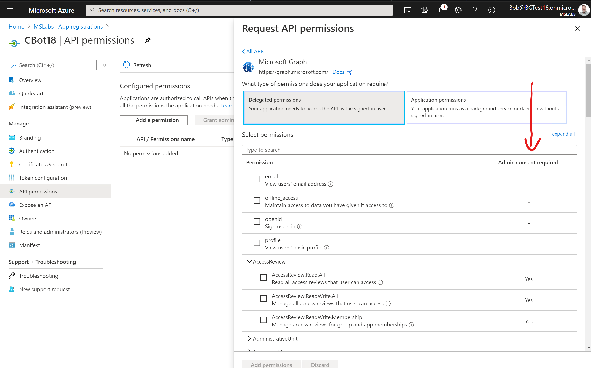
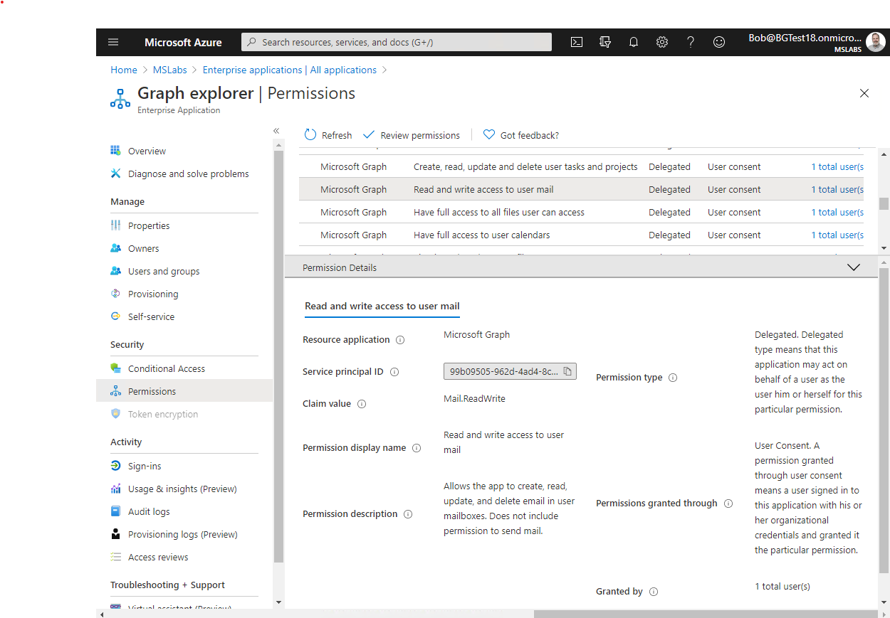
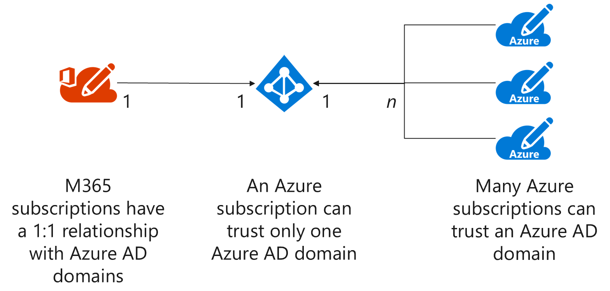
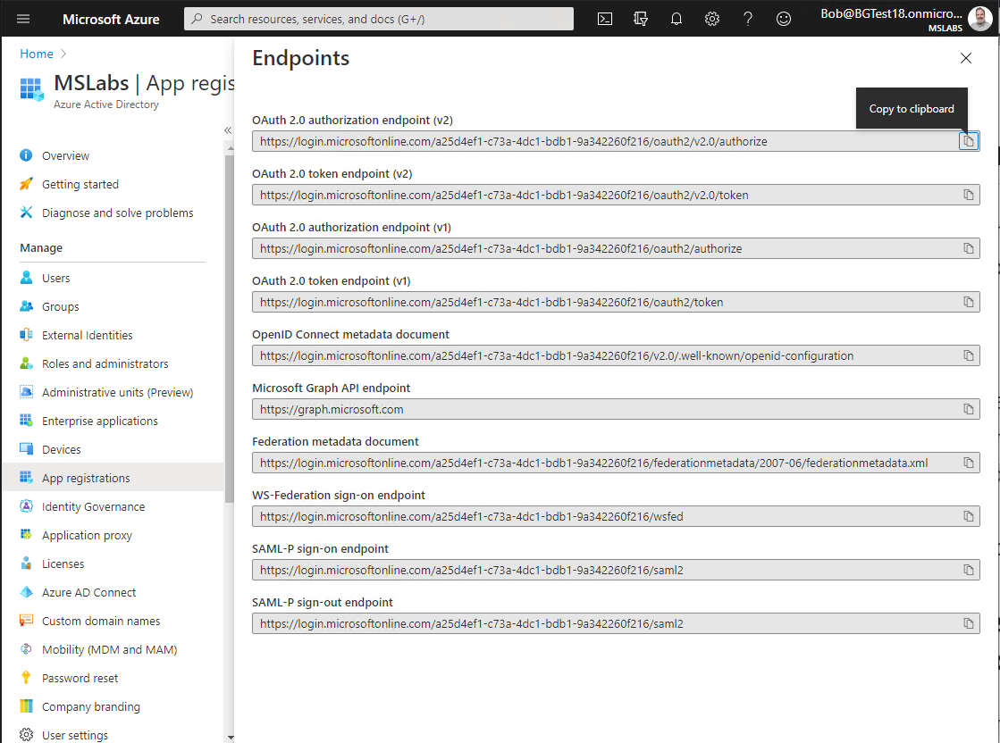

## What is the Microsoft Graph and why do you need it?

[Microsoft Graph](https://docs.microsoft.com/en-us/graph/overview) is the primary API for Microsoft 365 and for Microsoft Teams. It provides a single REST endpoint (https://graph.microsoft.com/) that can access data and insights across Microsoft 365 services. This includes Microsoft Teams and other services used by Teams such as SharePoint Online, Exchange Online, Excel, Planner, etc. 

You can check out the Graph in action using the [Microsoft Graph Explorer](https://developer.microsoft.com/en-us/graph/graph-explorer). Full reference documentation is [here](https://docs.microsoft.com/en-us/graph/api/overview?toc=./ref/toc.json&view=graph-rest-1.0) (you may want to check the [Beta version](https://docs.microsoft.com/en-us/graph/api/overview?toc=.%2Fref%2Ftoc.json&view=graph-rest-beta) as well.)

Many or most Microsoft Teams applications need to call the Graph to access user profiles, files, calendars, or even for simple things like querying the Team's channels or posting a message. Teams has a [Javascript client SDK](https://docs.microsoft.com/en-us/javascript/api/overview/msteams-client?view=msteams-client-js-latest) that is usable from tabs and task modules, but it's limited to a few helper functions. For most things you need the Graph!

In order to call the Graph, you need an access token from Azure Active Directory which establishes what, if anything, you're authorized to do. The method for obtaining that token varies depending on the type of application feature(s) you're building; for example a tab implemented as a Single Page Application will get an access token differently than a Bot. That's the reason for this article series! 

Each scenario is different, and has its own article. You can certainly just go to the article for your chosen scenario and skip the rest of this one. 

But before digging into the detailed scenarios, here are some concepts that apply to all the scenarios. These concepts are key to understanding how to build and deploy your application, and to avoiding the dreaded 401 "access denied" response from Microsoft Graph.

## What is Azure Active Directory and how can I get an access token?

Azure Active Directory (Azure AD) is the identity service used by Microsoft 365 and a number of other Microsoft cloud services. When you log into Microsoft Teams, Microsoft Outlook, SharePoint Online, or other Microsoft 365 services, you are logging into Azure AD. When your application wants to call a service that's secured by Azure AD, it needs to obtain an access token from Azure AD. The service should validate the token and read "claims" that establish your permission to use the service. Microsoft Graph is such a service, and it won't work unless you include an access token in the http header on every REST call.

You may find yourself wanting to look inside these tokens, usually during troubleshooting. They conform to the [JSON Web Token standard](https://tools.ietf.org/html/rfc7519); you can read all about it and decode tokens at [https://jwt.io](https://jwt.io). JWT tokens are digitally signed but not encrypted, so they should only be sent over secured (encrypted) channels such as https. For that reason, all Azure AD applications should use https and never http.

### App Registration and Consent

Consider a traditional PC application (in the broadest sense of a personal computer, including Windows, Mac, or Linux). When a user runs such an application, it has the full rights and permissions of that user. This presents a  risk, because the user can't realistically validate what the application is doing; for example,  an application could read files off the local computer and upload them somewhere without the user's knowledge.

More modern applications, such Windows store apps and smartphone apps, require that an application be registered with the system and the user gets to consent to what the application is allowed to do. For example, if the application wants to read the user's files, the user is asked to consent before the system will allow any file access.

Azure AD apps work that way too. To access a resource (such as the Microsoft Graph), an application must be registered in Azure AD. Azure AD will prompt the user or administrator to consent to specific permissions within that resource (such as reading the user's calendar). So even though a particular calendar belongs to a particular user, each application she uses can only read her calendar if she or her admin says it's OK.

So in every Graph scenario you'll have at least two applications: your application and the Graph, which is itself an Azure AD application. If you want to call the Graph, you need to register an application and request permission for your application to do things with the Graph, such as reading the user's calendar, or maybe every user's calendar. 

> The application you're calling - Graph in this case - is sometimes called a _resource_ or _audience_. In the Azure documentation is usually called a resource; in the JWT it's in a claim called "aud," which is short for audience. The permission - Calendar.Read in this case - is sometimes called a _scope_. These are defined in the [OAuth 2.0 specification](https://tools.ietf.org/html/rfc6749), which is the authorization framework used by Azure AD.

You can register your Azure AD application in the Azure portal (the Office 365 Admin Center also includes an Azure AD portal). Register your apps under the "App registration" section. This is where you request the initial [permissions](https://docs.microsoft.com/en-us/azure/active-directory/develop/v2-permissions-and-consent) for your application. Applications using the v2.0 endpoint can request additional permissions at runtime, but that's beyond the scope of this article.

When you choose permissions, you may notice that there's a column for "Administrative Consent Required". If this field is blank, then users can consent for themselves; if it's marked "yes", then a tenant administrator has to grant consent.

When someone - a user or admin - consents to an application's request for permission, Azure AD creates a _service principal_. These are called "Enterprise Applications" in the Azure portal. Your service principals may be for apps registered in your tenant, or in the case of a multi-tenant application, for some other tenant. If you logged into the Graph Explorer, for example, you'll see it under Enterprise Applications because you had to consent, even though the app registration is in Microsoft's tenant. If you want to revoke consent, the easiest way is to simply delete the app's service principal under enterprise applications

### User Delegated vs. Application Permissions

Azure AD supports two kinds of permissions:

  * **User delegated** permissions allow an application to act _on behalf of a user_. Therefore, the effective permission is the intersection of the user's permission and the application's permission. For example, suppose Sarah has access to files A, B, and C, and the application has Files.Read permission. When Sarah runs the application, it can read files A, B, and C.
  * **Application** permissions allow an application to act _on its own behalf_. Therefore the effective permission is generally the application's permission across the whole tenant. This is often used for daemon services or to elevate permissions beyond what the user can do. If an application has Files.Read permission, it can read every file in the entire Microsoft 365 tenant.

User delegated permissions always require the user to prove their identity (log in). In Azure AD this is usually done via some kind of web browser - either a pop-up or hosted browser. This prevents applications from ever touching the user's password or other secrets, and allows Azure AD to enforce policies like multi-factor authentication and conditional access. It also allows Azure AD to prompt the user for any missing consents.

In most cases, applications have to prove their identity as well. This is done using an _application secret_ (a secret string generated by Azure AD) or a digital certificate. There is no way to keep a secret in a web browser, so this is the exception: apps running in the browser (such as Teams tabs) can't prove their identity, and this limits the permissions they can have, and they can never have application permissions!  This is discussed further for each scenario. 

In Azure, the best place to store application secrets and certificates containing private keys is [Azure Key Vault](https://docs.microsoft.com/en-us/azure/key-vault/).

> Want to see what applications users and admins have consented to? It's under "Enterprise Applications" in the Azure AD portal. Each one has a Permissions page that has two tabs, one for Admin consents and one for User consents; you can see every detail.

### Azure AD Tenants

Each instance of Azure AD is called a _tenant_ and has a unique tenant ID (GUID) and DNS name (like contoso.onmicrosoft.com). Each Microsoft 365 subscription has exactly one Azure AD tenant.

While only one Microsoft 365 subscription can be associated with an Azure AD tenant, several Azure subscriptions can be, and it's possible to change an Azure subscription to associate with a different Azure AD tenant. (Check the "Subscriptions" panel in the Azure portal.) This is important because Azure AD will only be able to generate access tokens if:

 - The target application is in the same tenant, OR, 
 - The target application is marked as multi-tenant

In the case of the Microsoft Graph, you don't need to worry about this because Graph is already registered in Microsoft's tenant and is multi-tenant. But you may want to call your own services as well; in this case they need to be registered in your tenant or marked as multi-tenant.

## v1 and v2 endpoints

The Azure AD portal lists Azure AD _endpoints_ - that is, URL's where you can call Azure AD to get an access token. The v2 [endpoints have additional features](https://docs.microsoft.com/en-us/azure/active-directory/azuread-dev/azure-ad-endpoint-comparison), such as the ability to dynamically consent to permissions and to log in Microsoft personal accounts. However [sometimes you need to use the v1 endpoint](https://docs.microsoft.com/en-us/azure/active-directory/azuread-dev/azure-ad-endpoint-comparison#limitations), such as:

 * when calling an application that can only understand v1 tokens, such as an Azure Function that's secured using the built-in App Services authentication (sometimes called "easy auth")
 * when using an older client-side library such as the [Active Directory Authentication Library (ADAL)](https://docs.microsoft.com/en-us/azure/active-directory/azuread-dev/active-directory-authentication-libraries).

Microsoft Graph and most of the Microsoft 365 services support v2 tokens.

In some scenarios, you'll need to know the endpoint URL. You can find it in the Azure AD portal under App Registrations - not under a specific app registration, but in the App Registrations panel; it's the same for all the apps in your tenant.

Notice that both v1 and v2 endpoints are shown. The OAuth 2.0 token endpoint is the one you need to get an access token; in some scenarios you'll also need the authorization endpoint.

### Don't confuse Azure AD with these similar products

Be sure not to confuse Azure AD with other, similarly named services! **Azure AD is NOT the same as:**

 * [Active Directory](https://docs.microsoft.com/en-us/windows-server/identity/ad-ds/get-started/virtual-dc/active-directory-domain-services-overview): On its own, "Active Directory" refers to the older, on-premises identity service, usually Active Directory Domain Services. There are other related services such as [Active Directory Federation Services](https://docs.microsoft.com/en-us/windows-server/identity/active-directory-federation-services) and [Active Directory Rights Management Service](https://docs.microsoft.com/en-us/previous-versions/windows/it-pro/windows-server-2012-R2-and-2012/hh831364(v=ws.11)). These services an work together with Azure AD but for the purposes of a Teams developer, you can pretty much leave them to the IT pros and infrastructure experts who will sync and federate them with Azure AD. By the time you get to Teams, your user has signed into Azure AD. Move on folks, nothing to see here.
 * [Azure Access Control Service](https://docs.microsoft.com/en-us/previous-versions/azure/azure-services/hh147631(v=azure.100)) (Azure ACS): This service predates Azure AD and is still used by [SharePoint Add-ins](https://developer.microsoft.com/en-us/office/blogs/impact-of-azure-access-control-deprecation-for-sharepoint-add-ins/), but has otherwise been [retired](https://azure.microsoft.com/en-us/blog/one-month-retirement-notice-access-control-service/). 
 * [Azure AD B2C](https://azure.microsoft.com/en-us/services/active-directory/external-identities/b2c/): Despite the similar name, this is a completely different identity service used to federate with consumer identities such as Google and Facebook. It doesn't work with Microsoft 365 identities and can't be used to obtain an access token for calling the Graph.
 * Older versions of Azure AD came in two flavors, v1 and v2. In May, 2019 these were consolidated, however there are still two endpoints (more on this later). Documentation newer than May 2019 will avoid the older, more separate, versions.

When you're looking for documentation or samples, make sure you're looking at an up-to-date Azure AD scenario and not one of the other, similarly named services.

## Terminology review

The terminology isn't super consistent, so here's a summary just to be clear.

| term | synonyms | meaning |
|---|---|---|
| Tenant | Directory | An instance of an Azure AD directory |
| Tenant ID | Directory ID | A globally unique identifier (GUID) that identifies a tenant |
| Application ID | App ID, Client ID | A GUID that identifies an application registered in Azure AD |
| Application Secret | App secret, Client secret | A string that is used to authenticate an application's identity |
| Application Registration | App registration | An entry in Azure AD representing an application |
| Service Principal | Enterprise application | An entry in Azure AD representing administrative and user consents for an application. The service principal is in the tenant which has consented; the application registration may be in a different tenant if it's marked as multi-tenant |
