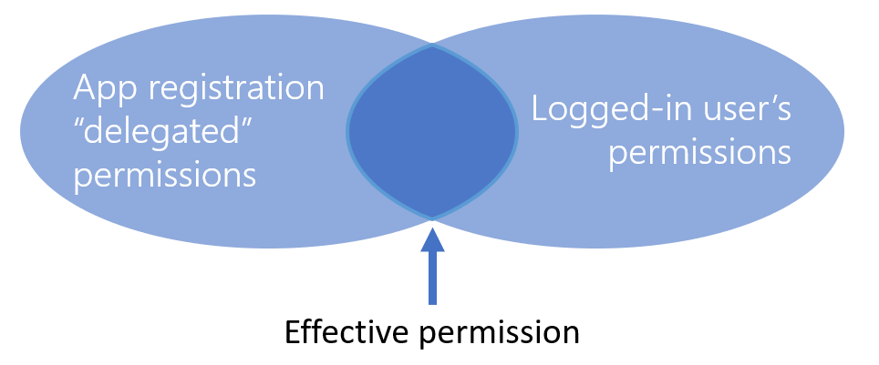
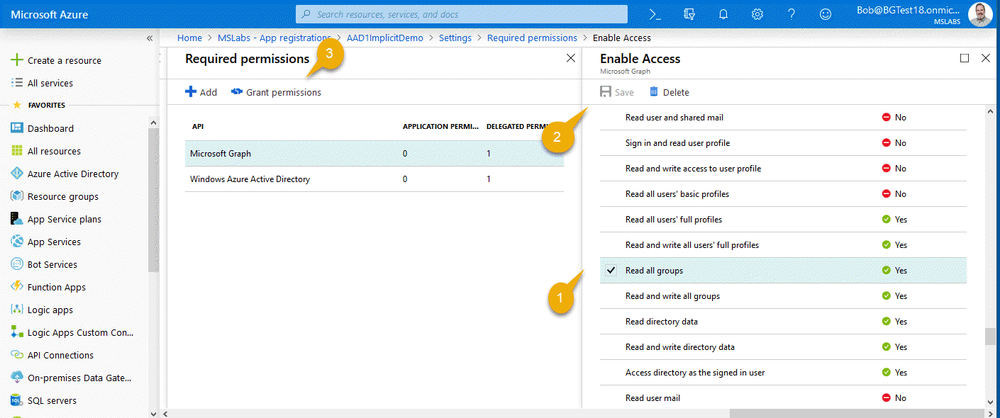
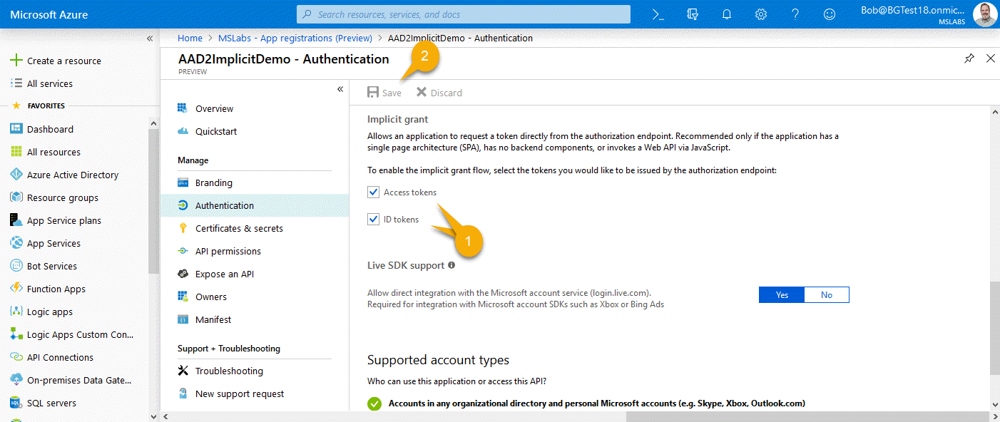
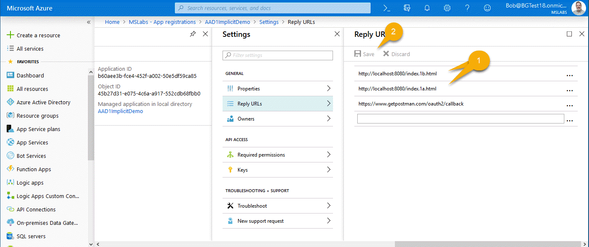
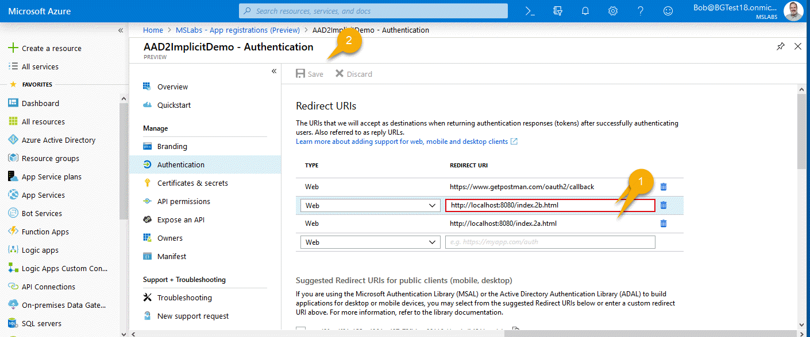
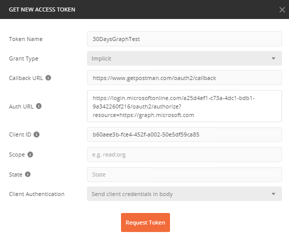
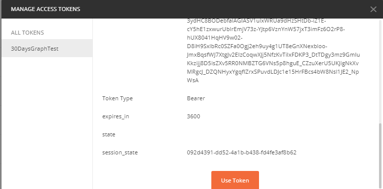
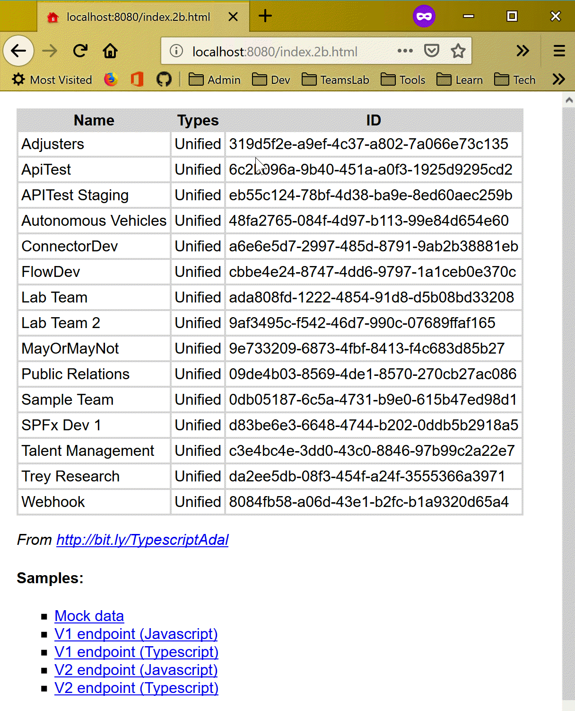

# Calling an Azure AD protected web service from your Single Page Application

To call the Microsoft Graph API, you need an access token which proves to the Graph that you're a legitimate user and what permission you should have. The instructions sound simple: "acquire an access token", right? But in reality you might as well tell someone to "fly to the moon." Obtaining the right access token is often the most challenging part of calling the Graph API!

This sample aims to demystify the the process of obtaining an Azure AD access token when your code is running in a web browser. It includes four samples: two all-in-one JavaScript samples using the familiar jQuery library (everything is in one file), and two more modern samples written with TypeScript, React, and Webpack. The latter may be helpful if you're writing a full-on single-page application with a bundling system such as Webpack.

<table>
<tr><th>File</th><th>Description</th></tr>
<tr><td>index.1a.html</td><td>v1 endpoint using ADAL with jQuery</td>
<tr><td>index.1b.html</td><td>v1 endpoint using ADAL with TypeScript, Webpack, and React</td>
<tr><td>index.2a.html</td><td>v2 endpoint using MSAL with jQuery</td>
<tr><td>index.2b.html</td><td>v2 endpoint using MSAL with TypeScript, Webpack, and React</td>
</table>

## A tale of two endpoints

Azure AD has two ways of registering and authorizing applications: the old way (via the "v1 endpoint") and the new way (via the "v2 endpoint"). Each one has its own registration and client-side library as well as its own endpoint URL for accessing the service. The choice is yours; [this article](https://doc.microsoft.com/en-us/azure/active-directory/develop/azure-ad-endpoint-comparison) can help you decide. This sample will show both, using the [ADAL.js](https://doc.microsoft.com/en-us/azure/active-directory/develop/active-directory-authentication-libraries) library for v1 access and [MSAL (preview)](https://doc.microsoft.com/en-us/azure/active-directory/develop/reference-v2-libraries) for v2 access.

## App Registrations

This demo was developed for the [30 Days of Microsoft Graph](https://developer.microsoft.com/en-us/graph/blogs/announcing-30-days-of-microsoft-graph-blog-series/) blog series, and the app registrations build on the articles for [day 9](https://developer.microsoft.com/en-us/graph/blogs/30daysmsgraph-day-9-azure-ad-applications-on-v2-endpoint/) and [day 10](https://developer.microsoft.com/en-us/graph/blogs/30daysmsgraph-day-10-azure-ad-applications-on-v1-endpoint/) for Azure AD v2 and v1 respectively. These applications were used in several other articles. This article will walk you through the steps to update these registrations so you can use them directly in a single-page application in a web browser. 

TIP: You might want to open the v1 and v2 app registrations in different browser tabs, so you can easily switch back and forth as you go through the V1 and V2 instructions for each step.

### Step 1. Add Delegated Permissions

To review, Azure AD has two permission models: application and delegated. Application permissions are like service accounts; they have their own direct access and aren't associated with any particular user. With delegated permissions, the application acts on behalf of a user, and is limited by both the application permissions and the end-user's permissions.



For security reasons, delegated permissions are the only ones allowed when calling directly from a web browser, so we need to add a delegated permission.

#### V1 instructions

Find the application you registered in the [day 10](https://developer.microsoft.com/en-us/graph/blogs/30daysmsgraph-day-10-azure-ad-applications-on-v1-endpoint/
) article, (or [register a new one](https://doc.microsoft.com/en-us/azure/active-directory/develop/quickstart-v1-add-azure-ad-app) of type Web app / API with the redirect URL http://localhost:8080/index.1a.html). Click Settings, then Required Permissions, and click into the Microsoft Graph API. The application permissions are at the top, and the delegated at the bottom, so scroll way down and make sure you're selecting the delegated one - it can get confusing!



You need to check the "Read all groups" delegated permission (1); you can see the scope, group.read.all, if you hover over it. We'll need the scope in our code. 

Now notice that some of these permissions require an administrator to consent (those marked with a green "Yes") - so what that's saying is that a tenant administrator needs to approve your application's ability to have the permission. All the app permissions and some of the delegated ones require administrator consent. So, after clicking Save (2), click "Grant Permissions" (3) and agree to allow the permissions.

#### V2 Instructions

Return to the application you created on [day 9](https://developer.microsoft.com/en-us/graph/blogs/30daysmsgraph-day-9-azure-ad-applications-on-v2-endpoint/) (or [create a new one](https://doc.microsoft.com/en-us/azure/active-directory/develop/quickstart-v2-register-an-app) with your choice of supported account types. Don't worry about Redirect URL yet.)

Click "API Permissions" to open the permissions panel.


Then pick + Add a permission (1), and add the delegated Group.Read.All permission (2). Then, because this scope requires administrative consent, click the button (3) and agree.

### Step 2 - Enable Implicit Flow

The OAuth 2.0 standard includes several "flows" for getting a access token. If you're in a web browser using Azure AD, you need to use [implicit flow](https://doc.microsoft.com/en-us/azure/active-directory/develop/v1-oauth2-implicit-grant-flow) because it doesn't require the browser to handle any secrets like an app password or key. 

There's no way to keep a secret in the web browser where the user can always pop into the developer console, so it's better not to try. Instead of using a secret, implicit flow requires the user to log in from the web browser and to consent (once) to letting the application act on his or her behalf. 
Since the only security is the user's login, you can only use delegated permissions with implicit flow.

In addition, because implicit flow is less secure than the other OAuth flows, you need to mark the application as allowing implicit flow in Azure AD.

#### V1 Instructions

In old-school Azure AD, you need to edit the manifest JSON to enable implicit flow. Click the "Edit Manifest" button, and set "oauthAllowImplicitFlow" to true (it's false by default).


Click Save and you're done.

#### V2 Instructions

The shiny new Azure AD takes a giant leap forward with actual checkboxes for implicit flow!



Check them, click Save, and you're done.

### Step 3 - Add the redirect URLs

Now you might have been wondering about these redirect URLs; with some OAuth flows they're not even used. We'll need them for sure this time! 

Getting an access token isn't as simple as making a web service call because Azure AD might need to interact with the user to log in and consent to the permissions. So the implicit "flow" is to redirect the web browser (either main page or a popup window) right to Azure AD, and let it take over the UI for a while  - or for just for an instant if the user has already logged in and consented. When it's done, Azure AD redirects back to your site with the token in the URL hash (or an error if something went wrong). That URL is called the Redirect or Reply URL.

Redirect URLs need to be registered to prevent a hacker from requesting an access token be sent to some unknown site. So to make the demos work, you'll need to register the redirect URL's.

#### V1 Instructions

In your application, click Settings, then Reply URLs.



Add one for each of the V1 demos, and one for Postman: https://www.getpostman.com/oauth2/callback, http://localhost:8080/index.1a.html and http://localhost:8080/index.1b.html.

#### V2 Instructions

In your application's overview page, you'll see a link to the Redirect URLs in the right column of information.



Add one for each of the V2 demos, and one for Postman: https://www.getpostman.com/oauth2/callback,  
http://localhost:8080/index.2a.html and http://localhost:8080/index.2b.html.

NOTE: At the time of this writing, the Azure AD App Registrations (Preview) section in the Azure Portal does not allow "." characters in Redirect URL's. You can add them using the old stand-alone [Application Registration Portal](https://apps.dev.microsoft.com/).

## Testing your app registrations

Now let's use [Postman](https://www.getpostman.com/), which was introduced in [day 13](https://developer.microsoft.com/en-us/graph/blogs/30daysmsgraph-day-13-postman-to-make-microsoft-graph-calls/). That article used the client credentials flow, which is useful in services that want to run under app permissions. This time, we'll use it with Implicit Flow.

#### V1 instructions

In your app registration, back out to the overall v1 registration page (where all the apps are listed) and click Endpoints. Grab a copy of the Authorization endpoint; this has your tenant ID already set up in the right place.


Open Postman and add a new request. Enter the Graph API query

https://graph.microsoft.com/v1.0/groups/?$orderby=displayName

which returns all the Azure AD groups the user has permission to see, sorted by display name. On the Headers tab, add a header with the key "Accept" and the value "application/json". Now click on the Authorization tab, and select OAuth 2.0 authentication.

NOTE: On day 13, the instructions had you request the token manually; this is necessary because the Client Credentials flow built into Postman doesn't work with Azure AD. The Implicit Flow in Postman works fine, however, so these instructions will use it.

Click on the Authorization tab and set the type to OAuth 2.0. Click Get New Access Token and fill in the dialog box. Name your token whatever you like, and set the Grant Type to Implicit. For callback URL, enter https://www.getpostman.com/oauth2/callback (same as you added to the reply URL's in the app registration). Paste in the Auth URL you copied above, and add ?resource=https://graph.microsoft.com to the end to specify the resource you want a token for. Paste in your Client ID (application ID) from the app registration and you're done; you can leave Scope and State blank. 



Then press Request Token. You should get back a token! If not, you might want to hit ctrl+alt+C to open the Postman console to inspect the error. Scroll down to the bottom of the token and click Use Token



At this point you should be able to send the request and see the groups as JSON in the bottom window.


#### V2 Instructions

Now go to the V2 app registration. This time the endpoints button is at the top on the app registration's Overview blade. Copy the OAuth 2.0 authorization endpoint (v2).

In Postman, request a new token, this time using the V2 endpoint with ?resource=https://graph.microsoft.com appended as before. Also, you'll need to use the v2 Client ID (Application ID), and your initial scope (you can add more dynamically with V2) of group.read.all.

. 

Request the token as before; you should be able to make the same Graph call with this token as well.

If all that works, you're ready to do the same thing in browser code! That will be tomorrow's installment in the 30 Days Graph series; see you then!

## Sample Applications

There are [four samples](https://github.com/BobGerman/AADsamples/tree/master/implicitFlow) that accompany this article, so you'll still get to choose your flavor:

<table>
<tr><th>File</th><th>Description</th></tr>
<tr><td>index.1a.html</td><td>v1 endpoint using ADAL with jQuery</td>
<tr><td>index.1b.html</td><td>v1 endpoint using ADAL with TypeScript, Webpack, and React</td>
<tr><td>index.2a.html</td><td>v2 endpoint using MSAL with jQuery</td>
<tr><td>index.2b.html</td><td>v2 endpoint using MSAL with TypeScript, Webpack, and React</td>
</table>

The JavaScript examples are really simple, with good old jQuery and all the code on one page. They're actually drawn from elsewhere; the Azure AD V1  sample is from [Julie Turner's](https://twitter.com/jfj1997) awesome article series, [Extending SharePoint with ADAL and the Microsoft Graph API](https://julieturner.net/2017/01/extending-sharepoint-with-adal-and-the-microsoft-graph-api-part-1-the-setup/); the V2 example is from [this Microsoft tutorial.](https://doc.microsoft.com/en-us/azure/active-directory/develop/tutorial-v2-javascript-spa).

The TypeScript examples are new, and are intended for developers building full scale single page applications. They're also instructive because TypeScript made it easy to separate the authentication code from the Graph calls and user interface, so it's a lot easier to see what's going on.

## Configure the Sample

First, clone or download the sample code from [https://github.com/BobGerman/AADsamples](https://github.com/BobGerman/AADsamples); this sample is in the [implicitFlow](https://github.com/BobGerman/AADsamples/tree/master/implicitFlow) folder. You'll need to have [Node](https://nodejs.org/en/download/) installed to build the TypeScript demos, and to run all of them.

From a command line in the implicitFlow directory, type:

    npm install
    npm install http-server -g

Now edit the code to include your App IDs and other details.

* In [index.1a.html](https://github.com/BobGerman/AADsamples/blob/master/implicitFlow/index.1a.html), plug in your V1 client ID (the Application ID) and tenant id (like "mytenant.onmicrosoft.com)
* In [index.2a.html](https://github.com/BobGerman/AADsamples/blob/master/implicitFlow/index.2a.html), plug in your V2 client ID (the Application ID).
* In the [src](https://github.com/BobGerman/AADsamples/tree/master/implicitFlow/src) folder, rename or copy constants.sample.ts to constants.ts, and plug in your V1 and V2 application IDs and your tenant id

Demos 2a and 2b require a build step to compile the TypeScript and make a webpack bundle. Type:

    npm run build

## Run the Sample

To start a local web server, type

    http-server

Point your web browser to

    http://localhost:8080

and you can navigate to the various demos.

The V1 JavaScript demo logs the user on and displays a bit of profile information; the V2 JavaScript demo is similar but has an explicit Login/Logout button. The TypeScript demos display a list of all groups in your tenant.



## Learning from the Code

Now you have 4 samples to check out, which all do the same thing. They first "log the user in" (validate the user and get an ID token), and then they get an access token that lets them call the Graph API.

### JavaScript Samples

If you're most comfortable in JavaScript and jQuery, the JavaScript samples are for you.

[index.1a.html](https://github.com/BobGerman/AADsamples/blob/master/implicitFlow/index.1a.html) shows ADAL and the v1 endpoint. Walking through the code can be a bit tricky because the same page is used to initiate the login and handle redirects after the user is logged in and the token is obtained. Here's the function which runs when the page is loaded:

```javascript
$(document).ready(function () {
    // Check For & Handle Redirect From AAD After Login or Acquiring Token
    var isCallback = sampleApp.authContext.isCallback(window.location.hash);

    if (isCallback && !sampleApp.authContext.getLoginError()) {
        sampleApp.authContext.handleWindowCallback(window.location.hash);
    } else {
        var user = sampleApp.authContext.getCachedUser();
        if (!user) {
            //Log in user
            sampleApp.authContext.login();
        } else {
            sampleApp.getGraphData();
        }
    }
```

Notice that it checks for a callback - that is, it asks ADAL if the page is running due to a redirect from Azure AD. authContext.handleWindowCallback() takes the token from Azure AD and puts it into local cache. If it needs to log the user in, it calls authContext.login() which _does not return_ - it redirects the browser window to Azure AD! The same thing can happen in the authContext.acquireToken() (not shown in the listing but it's in the code). 

[index.2a.html](https://github.com/BobGerman/AADsamples/blob/master/implicitFlow/index.2a.html) is similar, except it has login and logout buttons so the user can initiate the process. If the user isn't logged in, the page shows a login button (very little JavaScript runs). When the user clicks the button, they are logged in, but this time the Popup version of the login method is used, so the call returns a promise which is resolved when the user logs in via a popup window.

```javascript
function signIn() {
    myMSALObj.loginPopup(applicationConfig.graphScopes).then(function (idToken) {
        //Login Success
        showWelcomeMessage();
        acquireTokenPopupAndCallMSGraph();
    }, function (error) {
        console.log(error);
    });
}
```

### TypeScript samples (check them out even if you don't use TypeScript!)

With all the UI code, Graph calls, and authentication stuff mixed together, it can be a little hard to follow. So even if you're not a TypeScript developer, you might find it easier to understand the logic in the TypeScript examples.

The TypeScript SPA includes two services, [MSGraphService](https://github.com/BobGerman/AADsamples/blob/master/implicitFlow/src/services/MSGraphService/MSGraphService.ts) (which calls the Graph) and two implementations of an [AuthService](https://github.com/BobGerman/AADsamples/tree/master/implicitFlow/src/services/AuthService) (which gets the access token) - one each for V1 and V2. [ServiceFactory.ts](https://github.com/BobGerman/AADsamples/blob/master/implicitFlow/src/services/ServiceFactory.ts) provides rudimentary dependency injection, and creates the MSGraphService the V1 or V2 version of AuthService based on the scenario selected.

MSGraphService doesn't have to fuss about authentication, it just asks for a token and moves on:

```typescript
this.authService.getToken()
    .then((token) => {

        fetch(
            `https://graph.microsoft.com/v1.0/groups/?$orderby=displayName`,
            {
                method: "GET",
                mode: "cors",
                cache: "no-cache",
                headers: {
                    "Content-Type": "application/json",
                    "Authorization": "Bearer " + token
                }
            }
        )
        .then((response) => {
            // handle the response
        }
        // et cetera
```

The [v1 Auth service](https://github.com/BobGerman/AADsamples/blob/master/implicitFlow/src/services/AuthService/AuthServiceV1.ts) creates a new AuthenticationContext, which is the main object in ADAL, and then calls an internal function called ensureLogin() to make sure the user is logged in.

```typescript
private ensureLogin(authContext: AuthenticationContext): boolean {

    var isCallback = authContext.isCallback(window.location.hash);

    if (isCallback && !authContext.getLoginError()) {
        authContext.handleWindowCallback(window.location.hash);
    } else {
        var user = authContext.getCachedUser();
        if (!user) {
            authContext.login();
        } else {
            return true;
        }
    }
    return false;
}
```

It handles the login callback if necessary, which grabs the ID token off the URL hash, caches it, and sets the user state to logged in. If we don't have a callback, it looks for the user in cache. No cache means no user was logged in, so it calls authContext.login() - and again, that call never returns, it redirects to Azure AD.

Assuming ensureLogin() returns (maybe after a redirect or two), the code does the exact same thing to acquire the access token. If no access token is found in cache, it calls authContext.acquireToken() - another call that never returns, it redirects and the code will find the token in cache when Azure AD redirects back to the page.

```typescript
if (this.ensureLogin(authContext)) {

    let cachedToken = authContext.getCachedToken(constants.resourceId);
    if (cachedToken) {
        resolve(cachedToken);
    } else {
        authContext.acquireToken(
            constants.resourceId,
            (error, acquiredToken) => {
                if (error || !acquiredToken) {
                    reject(error);
                } else {
                    resolve(acquiredToken);
                }
            }
        );
    }
} else {
    reject(`Login error: ${authContext.getLoginError()}`);
}
```

The [V2 version of the Auth](https://github.com/BobGerman/AADsamples/blob/master/implicitFlow/src/services/AuthService/AuthServiceV2.ts) service is even more concise. Instead of ADAL's AuthenticationContext, we've got MSAL's UserAgentApplication ... kind of the same thing. This is all you need:

```typescript
// Ensure user is logged in
if (!userAgentApp.getUser() || userAgentApp.isCallback(window.location.hash)) {
    userAgentApp.loginRedirect(constants.scopes);
}

// Try to get a token silently
userAgentApp.acquireTokenSilent(constants.scopes)
    .then((accessToken) => {
        resolve(accessToken);
    })
    .catch((error) => {
        console.log(error);
        // If the error is due to a need for user interaction, then redirect to allow it
        if (error.indexOf("consent_required") !== -1 ||error.indexOf("interaction_required") !== -1 || error.indexOf("login_required") !== -1) {
            userAgentApp.acquireTokenRedirect(constants.scopes);
        } else {
            reject('Error acquiring token: ' + error);
        }
    });
```

The calls are different, but the logic is pretty much the same. In MSAL, the calls that redirect are clearly marked: loginRedirect() and acquireTokenRedirect(). There are popup versions of both those methods, which you can see in the JavaScript version.

## Conclusion

The simple instructions, "acquire an access token," might as well be "fly to the moon" for a new Graph developer. Here's hoping your experience was easier than rocket science, and you're now equipped to use it in your single page applications and other browser based solutions!