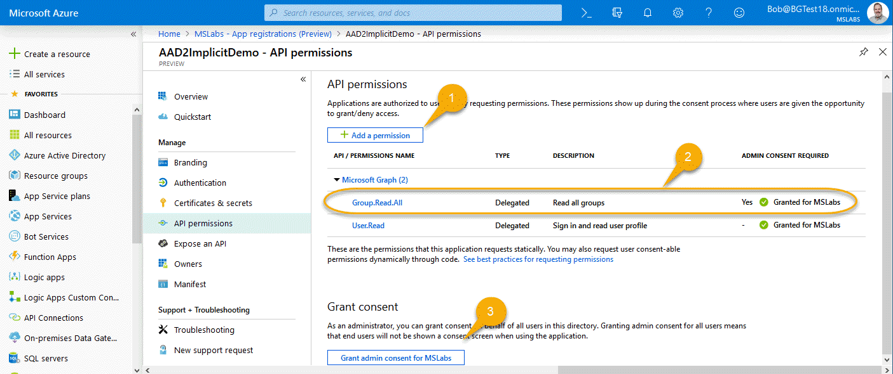
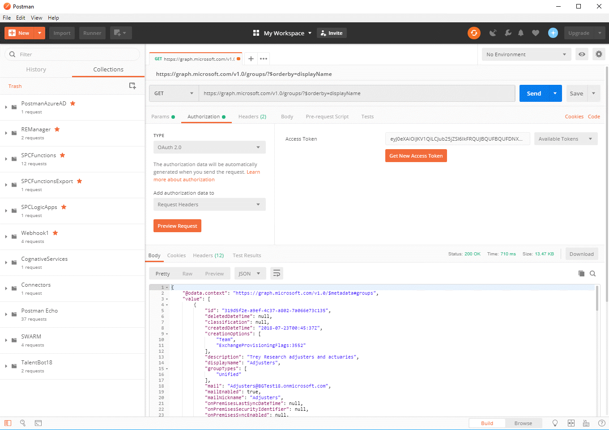

# Day ??? - Calling the Microsoft Graph from a single-page application Part 1

In [day 15](https://developer.microsoft.com/en-us/graph/blogs/30daysmsgraph-day-15-microsoft-graph-in-dotnet-core-application/), you learned how to call the Graph API from a .NET command line application. Today and tomorrow, you'll learn to do much the same thing directly from a web browser in a Single Page Application. Today's article will walk you through updating your app registrations (for v1 and v2) so they'll work from the browser; tomorrow we'll dig into the code.

There are a couple of big differences between the native application example on day 15 and this one:

* The code will be written in JavaScript or TypeScript, because that's what runs in the browser
* We'll have to use a different OAuth 2.0 flow, "implicit flow" to get the access token for use with Microsoft Graph, because again, with Azure AD that's what runs in the browser

Here are the steps needed to prepare for the single page application samples coming in tomorrow's article.

## Updating your App Registrations

This demo builds on the articles for [day 9](https://developer.microsoft.com/en-us/graph/blogs/30daysmsgraph-day-9-azure-ad-applications-on-v2-endpoint/) and [day 10](https://developer.microsoft.com/en-us/graph/blogs/30daysmsgraph-day-10-azure-ad-applications-on-v1-endpoint/), where you registered applications in Azure AD v2 and v1 respectively. These applications were used in several other articles. This article will walk you through the steps to update these registrations so you can use them directly in a single-page application in a web browser. 

TIP: You might want to open the v1 and v2 app registrations in different browser tabs, so you can easily switch back and forth as you go through the V1 and V2 instructions for each step.

### Step 1. Add Delegated Permissions

To review, Azure AD has two permission models: application and delegated. Application permissions are like service accounts; they have their own direct access and aren't associated with any particular user. With delegated permissions, the application acts on behalf of a user, and is limited by both the application permissions and the end-user's permissions.

For security reasons, delegated permissions are the only ones allowed when calling directly from a web browser, so we need to add a delegated permission.

#### V1 instructions

Find the application you registered in the [day 10](https://developer.microsoft.com/en-us/graph/blogs/30daysmsgraph-day-10-azure-ad-applications-on-v1-endpoint/
) article, (or [register a new one](https://docs.microsoft.com/en-us/azure/active-directory/develop/quickstart-v1-add-azure-ad-app) of type Web app / API with the redirect URL http://localhost:8080/index.1a.html). Click Settings, then Required Permissions, and click into the Microsoft Graph API. The application permissions are at the top, and the delegated at the bottom, so scroll way down and make sure you're selecting the delegated one - it can get confusing!

You need to check the "Read all groups" delegated permission (1); you can see the scope, group.read.all, if you hover over it. We'll need the scope in our code. 

Now notice that some of these permissions require an administrator to consent (those marked with a green "Yes") - so what that's saying is that a tenant administrator needs to approve your application's ability to have the permission. All the app permissions and some of the delegated ones require administrator consent. So, after clicking Save (2), click "Grant Permissions" (3) and agree to allow the permissions.

#### V2 Instructions

Return to the application you created on [day 9](https://developer.microsoft.com/en-us/graph/blogs/30daysmsgraph-day-9-azure-ad-applications-on-v2-endpoint/) (or [create a new one](https://docs.microsoft.com/en-us/azure/active-directory/develop/quickstart-v2-register-an-app) with your choice of supported account types. Don't worry about Redirect URL yet.)

Click "API Permissions" to open the permissions panel.

Then pick + Add a permission (1), and add the delegated Group.Read.All permission (2). Then, because this scope requires administrative consent, click the button (3) and agree.

### Step 2 - Enable Implicit Flow

The OAuth 2.0 standard includes several "flows" for getting a access token. If you're in a web browser using Azure AD, you need to use [implicit flow](https://docs.microsoft.com/en-us/azure/active-directory/develop/v1-oauth2-implicit-grant-flow) because it doesn't require the browser to handle any secrets like an app password or key. 

There's no way to keep a secret in the web browser where the user can always pop into the developer console, so it's better not to try. Instead of using a secret, implicit flow requires the user to log in from the web browser and to consent (once) to letting the application act on his or her behalf. 
Since the only security is the user's login, you can only use delegated permissions with implicit flow.

In addition, because implicit flow is less secure than the other OAuth flows, you need to mark the application as allowing implicit flow in Azure AD.

#### V1 Instructions

In old-school Azure AD, you need to edit the manifest JSON to enable implicit flow. Click the "Edit Manifest" button, and set "oauthAllowImplicitFlow" to true (it's false by default).

Click Save and you're done.

#### V2 Instructions

The shiny new Azure AD takes a giant leap forward with actual checkboxes for implicit flow!

Check them, click Save, and you're done.

### Step 3 - Add the redirect URLs

Now you might have been wondering about these redirect URLs; with some OAuth flows they're not even used. We'll need them for sure this time! 

Getting an access token isn't as simple as making a web service call because Azure AD might need to interact with the user to log in and consent to the permissions. So the implicit "flow" is to redirect the web browser (either main page or a popup window) right to Azure AD, and let it take over the UI for a while  - or for just for an instant if the user has already logged in and consented. When it's done, Azure AD redirects back to your site with the token in the URL hash (or an error if something went wrong). That URL is called the Redirect or Reply URL.

Redirect URLs need to be registered to prevent a hacker from requesting an access token be sent to some unknown site. So to make the demos work, you'll need to register the redirect URL's.

#### V1 Instructions

In your application, click Settings, then Reply URLs.

Add one for each of the V1 demos, and one for Postman: https://www.getpostman.com/oauth2/callback, http://localhost:8080/index.1a.html and http://localhost:8080/index.1b.html.

#### V2 Instructions

In your application's overview page, you'll see a link to the Redirect URLs in the right column of information.

Add one for each of the V2 demos, and one for Postman: https://www.getpostman.com/oauth2/callback,  
http://localhost:8080/index.2a.html and http://localhost:8080/index.2b.html.

NOTE: At the time of this writing, the Azure AD App Registrations (Preview) section in the Azure Portal does not allow "." characters in Redirect URL's. You can add them using the old stand-alone [Application Registration Portal](https://apps.dev.microsoft.com/).

## Testing your application registrations

Now let's use [Postman](https://www.getpostman.com/), which was introduced in [day 13](https://developer.microsoft.com/en-us/graph/blogs/30daysmsgraph-day-13-postman-to-make-microsoft-graph-calls/). That article used the client credentials flow, which is useful in services that want to run under app permissions. This time, we'll use it with Implicit Flow.

#### V1 instructions

In your app registration, back out to the overall v1 registration page (where all the apps are listed) and click Endpoints. Grab a copy of the Authorization endpoint; this has your tenant ID already set up in the right place.

Open Postman and add a new request. Enter the Graph API query

https://graph.microsoft.com/v1.0/groups/?$orderby=displayName

which returns all the Azure AD groups the user has permission to see, sorted by display name. On the Headers tab, add a header with the key "Accept" and the value "application/json". Now click on the Authorization tab, and select OAuth 2.0 authentication.

NOTE: On day 13, the instructions had you request the token manually; this is necessary because the Client Credentials flow built into Postman doesn't work with Azure AD. The Implicit Flow in Postman works fine, however, so these instructions will use it.

Click on the Authorization tab and set the type to OAuth 2.0. Click Get New Access Token and fill in the dialog box. Name your token whatever you like, and set the Grant Type to Implicit. For callback URL, enter https://www.getpostman.com/oauth2/callback (same as you added to the reply URL's in the app registration). Paste in the Auth URL you copied above, and add ?resource=https://graph.microsoft.com to the end to specify the resource you want a token for. Paste in your Client ID (application ID) from the app registration and you're done; you can leave Scope and State blank. 

Then press Request Token. You should get back a token! If not, you might want to hit ctrl+alt+C to open the Postman console to inspect the error. Scroll down to the bottom of the token and click Use Token

At this point you should be able to send the request and see the groups as JSON in the bottom window.

#### V2 Instructions

Now go to the V2 app registration. This time the endpoints button is at the top on the app registration's Overview blade. Copy the OAuth 2.0 authorization endpoint (v2).

In Postman, request a new token, this time using the V2 endpoint with ?resource=https://graph.microsoft.com appended as before. Also, you'll need to use the v2 Client ID (Application ID), and your initial scope (you can add more dynamically with V2) of group.read.all.

. 

Request the token as before; you should be able to make the same Graph call with this token as well.

If all that works, you're ready to do the same thing in browser code! That will be tomorrow's installment in the 30 Days Graph series; see you then!